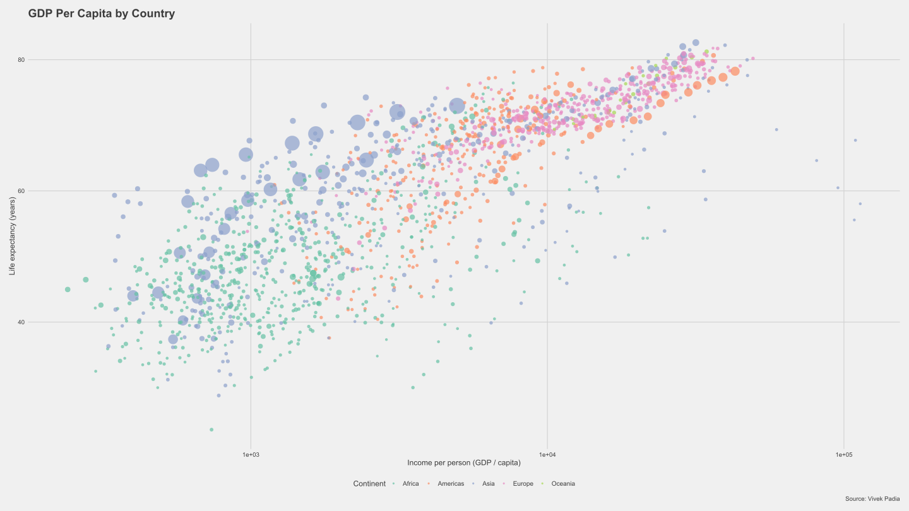

# GDP and Life Expectancy Animation

<a href="https://posit.co/download/rstudio-desktop" align="center"><br></a>

You need to install **R Studio** from [here](https://posit.co/download/rstudio-desktop/)

This code is designed to create an animated graph that shows the relationship between GDP per capita and life expectancy over time, using data from the gapminder dataset. The animation highlights changes in these variables by continent and year.

Various libraries which we are utlizing are:

```R
# Loading necessary libraries and dataset
library(gganimate)
library(ggplot2)
library(dplyr)
library(gapminder)
library(ggthemes)
```

## Getting Started
Before running this code, you will need to make sure that you have installed the necessary libraries. This code uses ggplot2, dplyr, gapminder, ggthemes, and gganimate.

Once you have installed the necessary libraries, you can run the code in your preferred R environment. The code will load the gapminder dataset and create a static graph using ggplot2. It will then create an animated version of this graph using gganimate.

```R
# Checking the gapminder dataset
gapminder
```

## Understanding the Code
The code first loads the necessary libraries and the gapminder dataset. It then creates a static graph using ggplot2, which displays the relationship between GDP per capita and life expectancy by continent, with the size of each point representing the population of the country. The x-axis is transformed using a log scale to better display the range of GDP per capita values in the data.

The code then uses gganimate to create an animated version of this graph. The graph is animated based on the "year" variable in the dataset, with each frame of the animation showing the data for a different year. The code also adds a subtitle to the animation to display the current year.

Finally, the code saves the resulting animation as a GIF file.

## Modifying the Code
If you would like to modify this code, you can adjust various parameters to customize the appearance and behavior of the graph. For example, you can change the color palette, adjust the size and opacity of the points, or modify the animation parameters to change the speed or duration of the animation.

```R
# Creating a static graph using ggplot2
graph1 = gapminder %>%
  ggplot(aes(
    x = gdpPercap,
    y = lifeExp,
    color = continent,
    size = pop
  )) +
  geom_point(alpha = 0.7, stroke = 0) +
  
  # Applying a theme
  theme_fivethirtyeight() +
  
  # Scaling size of points
  scale_size(range = c(2, 12), guide = "none") +
  
  # Applying a log transformation to the x-axis
  scale_x_log10() +
  
  # Adding labels and titles
  labs(
    title = "GDP Per Capita by Country",
    x = "Income per person (GDP / capita)",
    y = "Life expectancy (years)",
    color = "Continent",
    caption = "Source: Vivek Padia"
  ) +
  
  # Customizing the theme
  theme(
    axis.title = element_text(),
    text = element_text(family = "Rubik"),
    legend.text = element_text(size = 10)
  ) +
  
  # Using a color palette for the continents
  scale_color_brewer(palette = "Set2")
```
## Acknowledgments
This code was created by Vivek Padia. The data used in this code comes from the gapminder dataset, and the code was inspired by examples from the ggplot2 and gganimate documentation.


```R
# Displaying the static graph
graph1
```

## Output of the plot : <br>

<br><br>

## Adding animation to the graph
```R
# Creating an animated graph using gganimate
graph1.animation = graph1 +
  
  # Adding a transition based on the "year" variable in the dataset
  transition_time(year) +
  
  # Adding a subtitle showing the current year
  labs(subtitle = "Year: {frame_time}") +
  
  # Adding a shadow effect to improve animation quality
  shadow_wake(wake_length = 0.1)
```
## Viewing the animation
```R
# Displaying the animated graph using gganimate's animate function
animate(
  graph1.animation,
  height = 1080,
  width = 1728,
  fps = 40,
  duration = 10,
  end_pause = 60,
  res = 100
)
```

## Export the animated version of graph on local device
```R
# Saving the resulting animation as a GIF file
anim_save("GDP graph.gif")
```
## Reference images : <br>

<br><br>

This is the README file for GDP Growth repository. [^1]

[^1]: By : Vivek Padia.
